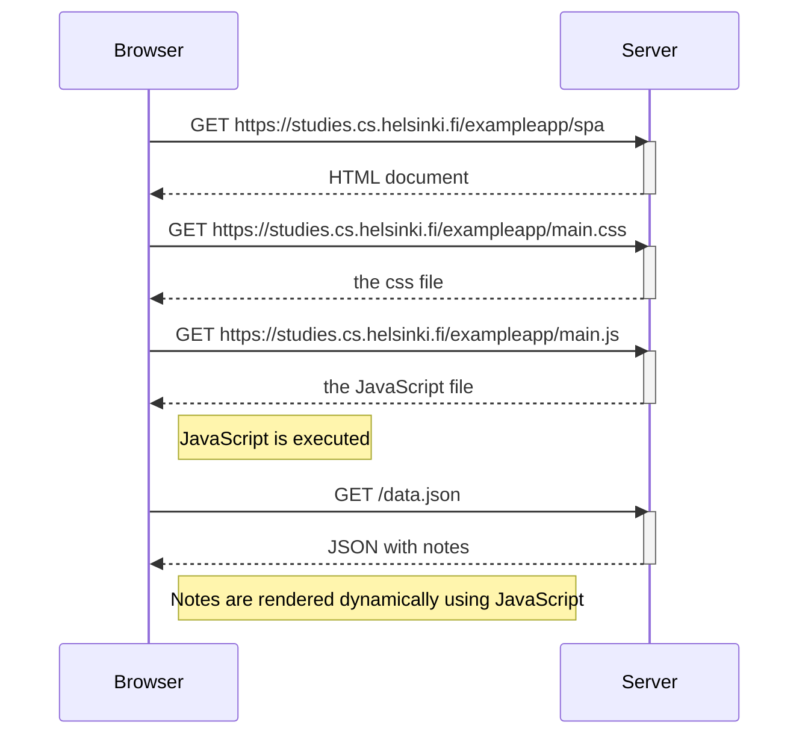

# Exercise 0.5: Single Page Application Diagram

```mermaid
sequenceDiagram
    participant Browser
    participant Server

    Browser->>Server: GET https://studies.cs.helsinki.fi/exampleapp/spa
    activate Server
    Server-->>Browser: HTML document
    deactivate Server

    Browser->>Server: GET https://studies.cs.helsinki.fi/exampleapp/main.css
    activate Server
    Server-->>Browser: the css file
    deactivate Server

    Browser->>Server: GET https://studies.cs.helsinki.fi/exampleapp/main.js
    activate Server
    Server-->>Browser: the JavaScript file
    deactivate Server

    Note right of Browser: JavaScript is executed 

    Browser->>Server: GET /data.json
    activate Server
    Server-->>Browser: JSON with notes
    deactivate Server

    Note right of Browser: Notes are rendered dynamically using JavaScript
```