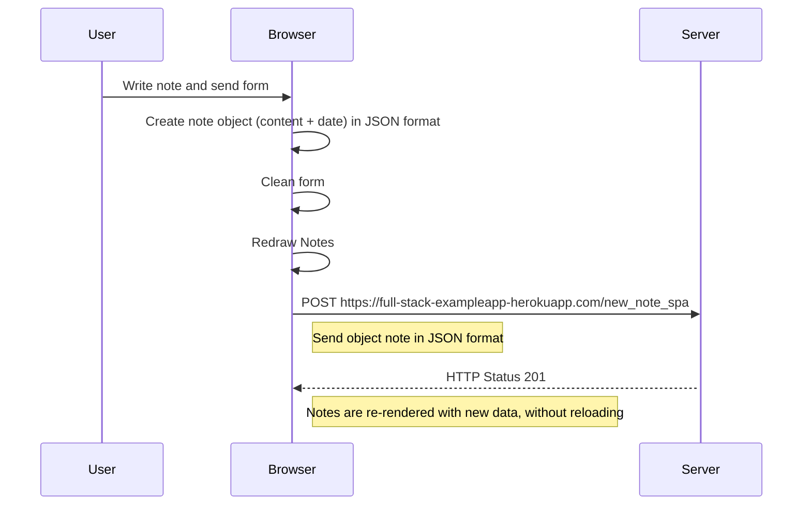

# Exercise 0.6: New Note in Single Page Application Diagram

```mermaid
sequenceDiagram
    participant User
    participant Browser
    participant Server

    User->>Browser: Write note and send form
    Browser->>Browser: Create note object (content + date) in JSON format
    Browser->>Browser: Clean form
    Browser->>Browser: Redraw Notes

    Browser->>Server: POST https://full-stack-exampleapp-herokuapp.com/new_note_spa
    activate Server

    Note right of Browser: Send object note in JSON format

    Server-->>Browser: HTTP Status 201

    Note right of Browser: Notes are re-rendered with new data, without reloading
```